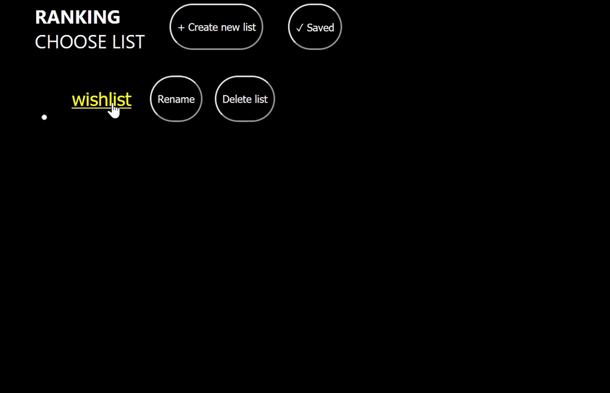

# Ranking app (work in progress)
A little web app for ranking your own defined elements, particularly products like books, movies and games. I will possibly implement options to import music from Spotify into list items.



## Open web app (serve locally)
This app isn't puclic on the web, it has to be served locally.

You can choose to either serve this app using Docker or XAMPP. For a Docker guide, read further. For a XAMPP guide, go to [this sub-directory's README](https://github.com/paalss/Ranking-app/blob/master/www/app/) (Ranking-app/www/app/).

**Prerequisites**

* Git

* Docker

**Start Docker Desktop**

**Download source code and run containers**

Open your commmand line, eg. Git Bash, navigate to where you want to download the project and run these commands:

```
git clone https://github.com/paalss/Ranking-app.git

cd Ranking-app/

cp sample.env .env

docker-compose up -d
```

If docker-compose up -d returns `ERROR: Service 'webserver' failed to build: The command '/bin/sh -c apt-get -y`, you might want to rebuild the container, using:

```
docker-compose build --no-cache
```

**Import database to your MySQL server**

You can import the database using PhpMyAdmin or Adminer.

Using PhpMyAdmin (fastest):

1. Go to [localhost:8080](http://localhost:8080) in a browser

2. In the interface, click the “import” tab. On this page, click “browse”, find and choose ranking_app.sql (`database/ranking_app.sql`), then click “Go” at the bottom of the page.

Using Adminer:

1. Go to [localhost:8081](http://localhost:8081)

2. log in with Server: database, Username: root and Password: tiger

3. In the interface, click the “import” tab. On this page, click “browse”, find and choose ranking_app.sql (`database/ranking_app.sql`), then click “Execute”.

**Open the site in a browser**

[localhost/app/](http://localhost/app/)

If everything worked correctly, you should see a premade list (named “wishlist”) on the page.

**Known bugs**

When deleting items and saving changes, the database doesn't always remove those records.

When an item is trashed, it can be deleted from GUI. Upon next saving, the app will tell the database which records to delete. Sometimes the database ignores it, even when the request data is all correct and the queries returns true.

<!-- ## Run automatic tests (jest&puppeteer)

**Navigate to the app folder and install the dependencies**

```
cd www/app/
npm install
```

**Run tests**

```
npm test
``` -->

## I've used code from 
* sprintcube/docker-compose-lamp for making this app serve-able with Docker. See more: https://github.com/sprintcube/docker-compose-lamp

* SortableJS/sortablejs for drag and drop functionality. See more: https://github.com/SortableJS/sortablejs